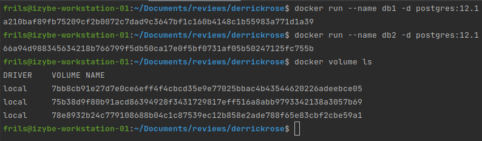
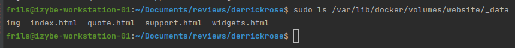

## goal : store static website data into docker volumes :
Previous topic we copied data into container but when it does scale up, we are wasting huge amount of volume.
To avoid that, we put data into a volume which will be shared between containers

### lab 1 : discover anonymous docker volumes

* run 2 different postgres containers :
  `docker run --name db1 -d postgres:12.1`
  `docker run --name db2 -d postgres:12.1`
* list existing volumes with the command :
  `docker volume ls`

==> Note that we should see two anonymous volumes 

* show information on the mounted volumes :
  `docker inspect db1 -f '{{ json .Mounts }}' | python3 -m json.tool`

* run a container temp with flag rm (delete volume when container stops):
  `docker run --name dbTemp --rm -d postgres:12.1`
* list existing volumes with the command (we should see 3 anonymous volumes):
  `docker volume ls`
* now we stop the container temp 
  `docker stop dbTemp db1 db2`
* list existing volumes with the command (we should see 2 anonymous volumes since the temp should have gone):
  `docker volume ls`

### lab 2 : create a docker volume

* create a docker volume with the name 'website':
  `docker volume create website`
* to see the mount point of the new created volume (where it is mounted), run command inspect :
  `docker volume inspect website`

==> /var/lib/docker/volumes/website/_data

### lab 3 : use the website volume

* copy files to the volume :
  `sudo cp -r ./ops/docker/00_acloud_course/03_storing_container_data_in_docker_volumes/web/* /var/lib/docker/volumes/website/_data`
* list copied files :
  `sudo ls /var/lib/docker/volumes/website/_data`

==> we should see this list of file 

* run a httpd container and mount the volume with data:
Following command will run a new container httpd version 2.4 with name web1 with its port 80 exposed and will detach the terminal, 
then associate the volume to the specified directory inside the conainter with read only access
 `docker run -d -p 80:80 --name web1 -v website:/usr/local/apache2/htdocs:ro httpd:2.4`
* **VERY IMPORTANT** : as long a volume is used by a container, if you run a container with rm flag, docker ain't remove it when the container is stopped
To check for it, we can run a new temp container using the same volume with the rm flag 

### lab 4 : clean up unused volumes

* removing unused volume :
  `docker volume prune`

### lab 5 : backup and restore volumes

First way to create a backup of our website files is to make it from our local computer (if we have root access)
* check first the mounted point with docker volume inspect :  
  `docker volume inspect website`

==> /var/lib/docker/volumes/website/_data

* then create an archive of the data inside the temp directory:
This command will create an archive under /tmp with name website_ plus the datetime with the given format.
Note that -C path is to change directory in order to point on where the files are and the last dot is to include all files
  `sudo tar czf /tmp/website_$(date +%Y-%m-%d-%H%M).tgz -C /var/lib/docker/volumes/website/_data  .`
* list created archive file : 
  `sudo ls /tmp/web*`

==> /tmp/website_2023-05-20-1853.tgz
* to look what inside the archive file :
  `tar tf /tmp/website_2023-05-20-1853.tgz`

Second way to create a backup of our website is to do it inside a running container
* connect into a running container web1 with an interactive mode :
  `docker exec -it web1 bash`
* create the archive file :
  `tar czf /tmp/website_$(date +%Y-%m-%d-%H%M).tgz htdocs/.`
* check the content of the archive :
  `tar tf /tmp/website_2023-05-20-1717.tgz`

Third way is to run a new container and passing the archive command on the bash
* run the command :
This command will run a bash container and mount two volumes then create a backup 
  `docker run  --rm --name website -v website:/website -v /tmp:/backup bash tar czf /backup/website_$(date +%Y-%m-%d-%H%M).tgz -C /website .`
* check the backup :
  `sudo ls -l /tmp`

To restore from the backup, use the same command tar but with argument xf to the directory you want it to be extracted.
You can either do it from the host if root access or within docker container 
