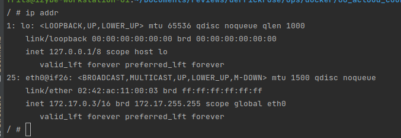

## goal : docker networking :

Docker provides 5 types of network and 3 of them are created by default

### lab1 : default network overview :

* list all provided network :
  `docker network ls`
* run a container :
  `docker run -d --name web httpd:2.4`
* check the type of bridge used by the container :
  ` docker inspect -f '{{ json .NetworkSettings.Networks }}' web | python3 -m json.tool`
==> bridge
* run a container busybox and interact with the running container :
  `docker run --rm -it busybox`
* check the ip adress of the container :
  `ip addr`
==> 172.17.0.3 as shown here 
* ping another existing running container on the same network :
  `ping 172.17.0.2`
==> successful ping, but we cannot ping by its name; also port 80 is accessible through bridge network even if we didn't expose it

### lab2 : bridge network overview :
* create a new bridge network :
  `docker network create test_network`
* list all provided network :
  `docker network ls`
* run a container using a specified network :
  `docker run --rm -d --name weboo --network test_network httpd:2.4`
* check the network being used by the container :
  `docker inspect -f '{{ json .NetworkSettings.Networks }}' weboo | python3 -m json.tool`
==> 172.18.0.2
* run a second container using the same specified network :
  `docker run --rm -it --name weboo1 --network test_network busybox`
* check its IP address :
  `ip addr` 
==> 172.18.0.3
* ping the first container by its ip address :
  `ping 172.18.0.2`
==> responding 
* download the home page :
  `wget 172.18.0.2`
==> able to download without specifying the port nor exposing it
* ping the first container by its name :
  `ping weboo`
==> successful ping by its name (since it is not using the default network)

### lab3 : host network overview :
* running a container on a host network :
  `docker run --rm -d --name busybox --network host -it busybox`
* check its IP address :
  `docker inspect -f '{{ json .NetworkSettings.Networks }}' web1 | python3 -m json.tool`
==> no IP address 
* try to download a page (use localhost, no need special networking since it interact from the host itself):
  `wget localhost`
==> page is getting downloaded (but if we stop the container, we will not be able to do so)
* 

### resume :
* the default network on a running container is bridge
* we can find (ping) any running container by its IP adress (not by name) if attached on the same bridge network
* we can find (ping) any running container by also its name if attached on a non-default network
* we can download pages from a web server container without specifying the port number nor exposing it
* being on the host network, we can find all containers attached on other networks